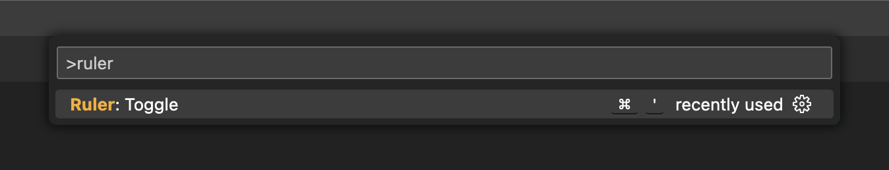
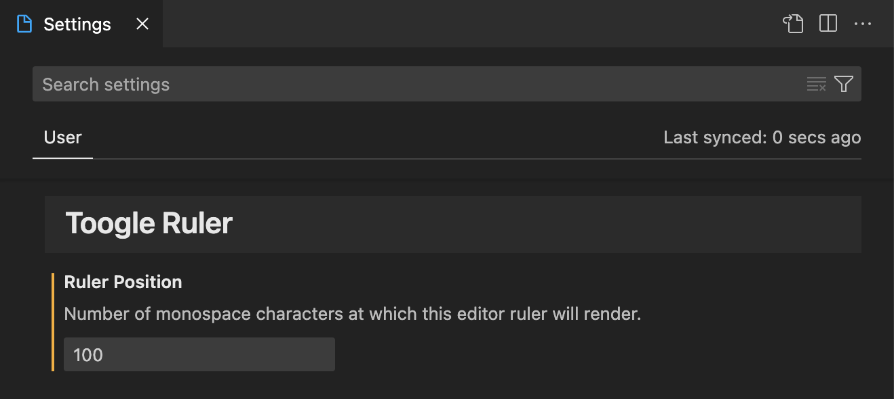
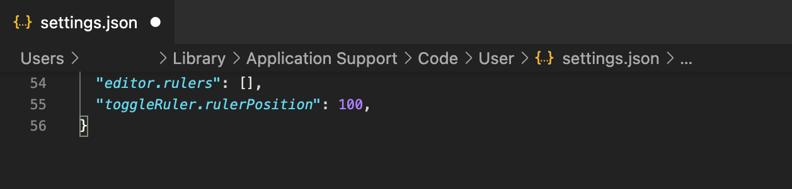

# Toggle Ruler Extension for Visual Studio Code

This is a Visual Studio Code extension that enables the ability to quickly toggle editor ruler via one of the following methods:

-   [Command palette](https://code.visualstudio.com/api/references/contribution-points#contributes.commands) by typing "Ruler: Toggle"
    
-   Keyboard shortcut
    -   Windows / Linux: <kbd>Ctrl</kbd> + <kbd>'</kbd>
    -   macOS: <kbd>Cmd</kbd> + <kbd>'</kbd>

## Extension Settings

The only extension settings is `toggleRuler.rulerPosition`, which defines the number of monospace characters at which this editor ruler will render. This can be changed from:

1. Visual Studio Code setting page
   
2. `settings.json` file
   
