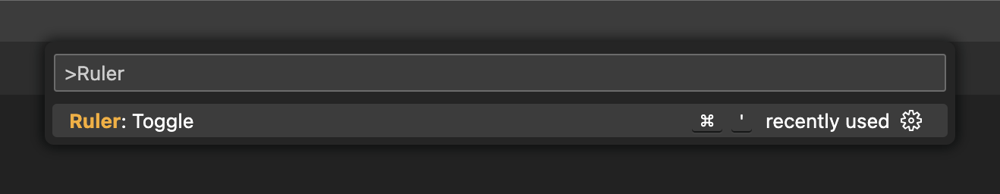
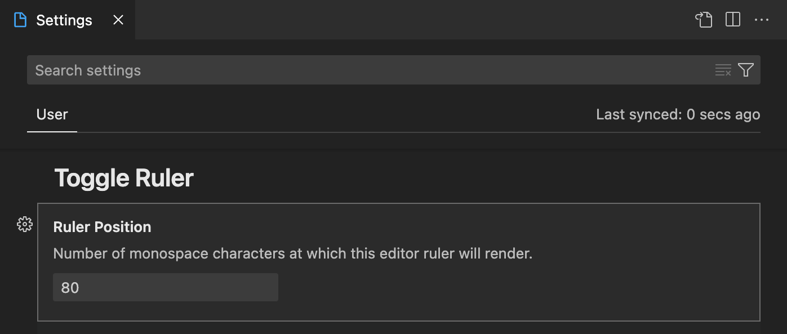

# Toggle Ruler Extension for Visual Studio Code

## Features

This is a Visual Studio Code extension that enables the ability to quickly toggle editor ruler via one of the following methods:

- [Command palette](https://code.visualstudio.com/api/references/contribution-points#contributes.commands)
- Keyboard shortcut `Ctrl + '` or `Cmd + '`

## Extension Settings

The only extension settings is `toggleRuler.rulerPosition`, which defines the number of monospace characters at which this editor ruler will render. This can be changed from:

1. Visual Studio Code setting page
   
2. `settings.json` file
   
